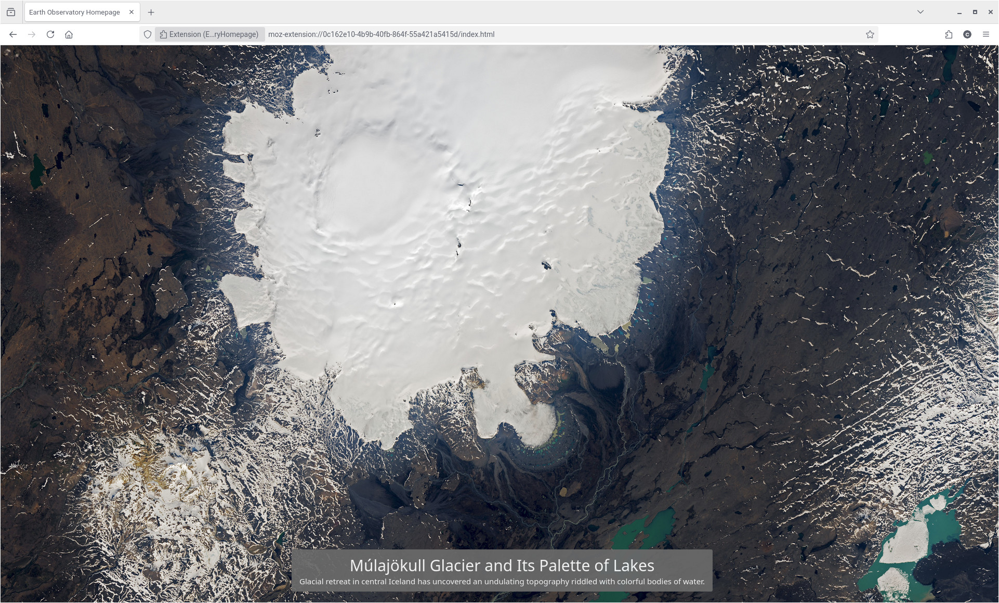

# Earth Observatory Homepage

An extension setting the homepage to the latest image from https://earthobservatory.nasa.gov.

https://addons.mozilla.org/en-US/firefox/addon/visibleearthhomepage/

The high-resolution image is displayed in full width.
A small caption gives the title and links to the corresponding article.

The latest entry information is found with the RSS feed. The high-resolution image url is found by scraping the article page. This is saved to local storage to speed subsequent accesses as much as possible.

**Disclaimer:** this is amateur code, I barely know what I am doing

This is not affiliated with NASA.

## Permissions

- webRequest
- storage
- access to `https://earthobservatory.nasa.gov/*`

## Preview

Result for the 30 July 2025:

